<!-- 
  ╔═══════════════════════════════════════════════════════════════╗
  ║           🎬 DRAMACHIA - AUTO-GENERATED README 🎬              ║
  ║     This file is automatically updated by GitHub Actions      ║
  ║              Last Update: Senin, 16 Februari 2026 pukul 13.50 WIB              ║
  ╚═══════════════════════════════════════════════════════════════╝
-->

 

  <b>DramaChia</b> adalah platform streaming drama China pendek (Chinese Short Drama) dan Drama Korea terlengkap dengan subtitle Indonesia berkualitas tinggi. Nikmati ratusan judul drama romantis, fantasi, hingga CEO dingin yang siap menemani waktu santai Anda secara gratis tanpa biaya berlangganan. Kami menghadirkan update episode terbaru setiap hari dengan tampilan mobile-friendly yang hemat kuota, memastikan hiburan tanpa batas kapan saja dan di mana saja.

 

&nbsp;

&nbsp;

  

 

 

## 🎬 Drama Terbaru

<table>
  <tr>
    <td align="center" width="150">
      <a href="https://dramachia.com/detail/42000006070">
        
         <b>Setelah Cerai, Tiga Ka...</b>
      </a>
    </td>    <td align="center" width="150">
      <a href="https://dramachia.com/detail/42000006096">
        
         <b>Asalku dari Zaman Kuno...</b>
      </a>
    </td>    <td align="center" width="150">
      <a href="https://dramachia.com/detail/42000006269">
        
         <b>Aku Bos Sebenarnya</b>
      </a>
    </td>    <td align="center" width="150">
      <a href="https://dramachia.com/detail/42000006122">
        
         <b>Digantikan, Lalu Menik...</b>
      </a>
    </td>    <td align="center" width="150">
      <a href="https://dramachia.com/detail/42000005239">
        
         <b>Murka Putri Dunia Bawah</b>
      </a>
    </td>    <td align="center" width="150">
      <a href="https://dramachia.com/detail/42000005956">
        
         <b>Aku Menumbuhkan Malaik...</b>
      </a>
    </td>
  </tr>
</table>

 

 

 

## 🔥 Drama Populer

<table>
  <tr>
    <td align="center" width="150">
      <a href="https://dramachia.com/detail/42000004908">
        
         <b>Merebut Kembali Harga ...</b>
      </a>
    </td>    <td align="center" width="150">
      <a href="https://dramachia.com/detail/42000004668">
        
         <b>Hati Sang Pahlawan (Su...</b>
      </a>
    </td>    <td align="center" width="150">
      <a href="https://dramachia.com/detail/41000122939">
        
         <b>Istriku Tiga, Takdirku...</b>
      </a>
    </td>    <td align="center" width="150">
      <a href="https://dramachia.com/detail/42000003970">
        
         <b>Ultimatum Sang Raja Mafia</b>
      </a>
    </td>    <td align="center" width="150">
      <a href="https://dramachia.com/detail/42000002890">
        
         <b>Kembalinya Sang Petinj...</b>
      </a>
    </td>    <td align="center" width="150">
      <a href="https://dramachia.com/detail/41000112448">
        
         <b>Kaisar Pulang ke Desa ...</b>
      </a>
    </td>
  </tr>
</table>

 

 

 

## 🏷️ Kategori Drama

 

 

## ✨ Fitur DramaChia

| | Fitur | Deskripsi |
|:---:|:---|:---|
| 🆓 | **100% Gratis** | Nonton semua drama tanpa biaya berlangganan |
| 📱 | **Mobile Friendly** | Tampilan responsif untuk semua perangkat |
| 🇮🇩 | **Subtitle Indonesia** | Semua drama dengan subtitle bahasa Indonesia |
| 🎬 | **Update Cepat** | Drama terbaru update setiap hari |
| 📶 | **Hemat Kuota** | Streaming dioptimasi untuk hemat data |
| 🔍 | **Pencarian Mudah** | Cari drama favorit dengan mudah |

 

 

## 🚀 Quick Links

| | Link | Deskripsi |
|:---:|:---:|:---|
| 🏠 | [**Home**](https://dramachia.com) | Halaman utama DramaChia |
| 🎬 | [**Drama Terbaru**](https://dramachia.com/latest) | Drama China terbaru |
| 🇰🇷 | [**Drakor**](https://dramachia.com/drakor/latest) | Drama Korea terbaru |
| 🔍 | [**Pencarian**](https://dramachia.com/search) | Cari drama favorit |
| ❓ | [**FAQ**](https://dramachia.com/faq) | Pertanyaan umum |

 

### Made with ❤️ by DramaChia Team

 

 

📅 Auto-updated: Senin, 16 Februari 2026 pukul 13.50 WIB

